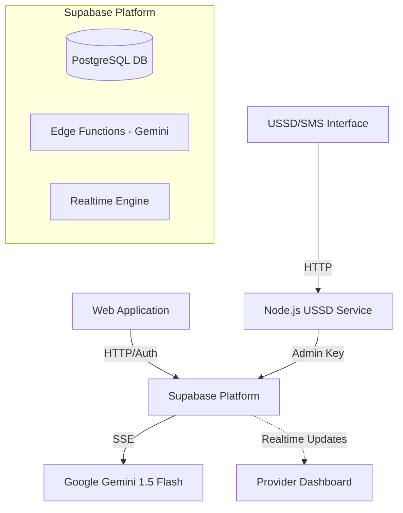

# NgaoMaternal Care: AI, Dataset, and Technical Workflow Documentation

This document provides a comprehensive technical overview of the NgaoMaternal Care platform, detailing its AI integration, data architecture, and operational workflows.

---

## 1. AI Model Documentation

NgaoMaternal Care leverages cutting-edge Generative AI to provide immediate support and educational resources to expectant mothers, bridging the gap between hospital visits.

### 1.1 Model Identity
- **Primary Model**: Google Gemini 1.5 Flash
- **secondary Model**: OpenAi gpt-4o-mini
- **Deployment**: Supabase Edge Functions (`gemini-chat`)
- **Interaction Pattern**: Server-Sent Events (SSE) for real-time streaming responses

### 1.2 Core AI Features
| Feature | Description | Technical Implementation |
| :--- | :--- | :--- |
| **Pregnancy Insights Chatbot** | A 24/7 empathetic assistant for maternal health queries. | SSE Streaming via `src/components/features/ChatBot.tsx` |
| **Content Suggestions** | AI-curated citations and resources from reputable sources (WHO, CDC, etc.). | Context-switching in `supabase/functions/gemini-chat/index.ts` |
| **Context Awareness** | The model maintains session history for conversational continuity. | Array-based message history passed in the API body |

### 1.3 System Prompts & Guardrails
The AI operates under two primary system contexts defined in the Edge Function:
- **Chat Context**: Focuses on compassion, evidence-based guidance, and cultural sensitivity.
- **Safety Guardrail**: Every AI response includes a mandatory recommendation to consult a healthcare provider for medical concerns.

---

## 2. Dataset Documentation

The system uses a Supabase-managed PostgreSQL database designed for high availability and real-time synchronization between USSD and Web platforms.

### 2.1 Core Schema Overview
The database is structured to track the user's journey from registration to postpartum.

| Table Name | Primary Purpose | Key Fields |
| :--- | :--- | :--- |
| `profiles` | Identity and Role Management | `id`, `full_name`, `role` (mother/provider), `phone_number` |
| `patient_records` | Clinical Snapshot | `pregnancy_week`, `blood_group`, `next_clinic_visit`, `risk_level` |
| `health_checkins` | Daily Monitoring | `symptoms`, `flagged` (boolean), `reviewed_by`, `notes` |
| `emergency_alerts` | Web Emergency Dispatch | `status` (active/resolved), `gps_location`, `triggered_by` |
| `ussd_emergency_alerts`| USSD Emergency Dispatch | `phone_number`, `session_id`, `status`, `notes` |
| `activity_logs` | Audit Trail | `action`, `entity_type`, `details`, `user_id` |

### 2.2 Data Integrity
- **Unified Sync**: Both the Web Dashboard and the USSD Service write to the same Supabase tables, ensuring that a provider sees a USSD emergency instantly in the web UI.
- **Row Level Security (RLS)**: Protects sensitive patient data, ensuring mothers can only see their own records while providers can view their assigned patients.

---

## 3. Technical Workflow Documentation

NgaoMaternal Care operates as a multi-channel ecosystem, ensuring that patients with or without internet can access life-saving services.

### 3.1 The Guardian Workflow (Health Monitoring)
1. **Input**: A patient completes a health check-in via the Web UI or USSD menu.
2. **Analysis**: The system correlates responses (e.g., "Severe Headache" + "Swollen Feet").
3. **Flagging**: If symptoms indicate risk, the `flagged` bit is set to `true`.
4. **Triage**: The patient appears in the "Flagged Check-ins" section of the Provider Dashboard.
5. **Resolution**: A healthcare provider reviews the case, adds notes, and marks it as resolved.

### 3.2 The LifeLine Workflow (Emergency Response)
1. **Trigger**: User clicks the "Panic Button" (Web) or selects "Option 0" (USSD).
2. **Dispatch**: An entry is created in `emergency_alerts` or `ussd_emergency_alerts`.
3. **Alerting**: The Provider Dashboard uses Supabase Realtime to play an alert sound and display a persistent notification.
4. **Response**: The provider acknowledges the alert, dispatching help to the GPS location or contact phone number.

### 3.3 The Link Workflow (AI Interaction)
1. **Request**: UI sends the user's message and history to the `gemini-chat` Edge Function.
2. **Processing**: The Edge Function attaches the "Compassionate Assistant" system prompt.
3. **Streaming**: Gemini processes the request and streams tokens back to the client via SSE.
4. **Context**: The React frontend (`ChatBot.tsx`) parses the stream and updates the bubble real-time.

---

## 4. Operational Architecture

---
**Last Updated**: 2026-03-12
**Status**: Active Production Documentation
